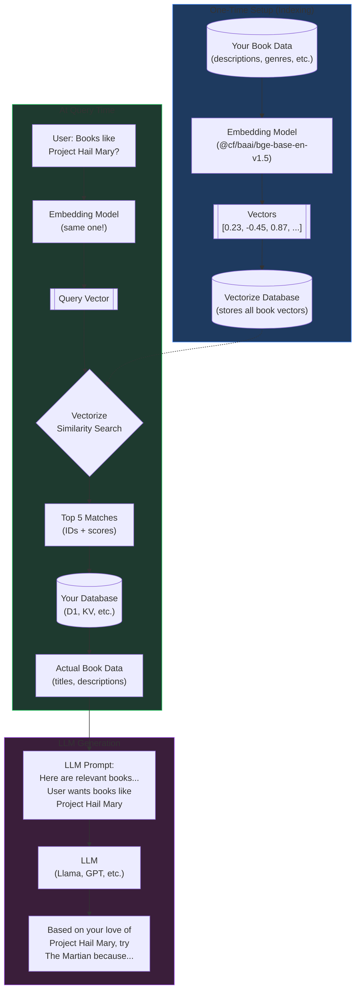

# RAG Pipeline Architecture

This diagram shows the Retrieval-Augmented Generation pipeline for book recommendations.

```mermaid
flowchart TB
    subgraph Setup ["One-Time Setup (Indexing)"]
        A[("Your Book Data<br/>(descriptions, genres, etc.)")] --> B["Embedding Model<br/>(@cf/baai/bge-base-en-v1.5)"]
        B --> C[["Vectors<br/>[0.23, -0.45, 0.87, ...]"]]
        C --> D[("Vectorize Database<br/>(stores all book vectors)")]
    end

    subgraph Query ["At Query Time"]
        E["User: Books like<br/>Project Hail Mary?"] --> F["Embedding Model<br/>(same one!)"]
        F --> G[["Query Vector"]]
        G --> H{"Vectorize<br/>Similarity Search"}
        D -.-> H
        H --> I["Top 5 Matches<br/>(IDs + scores)"]
        I --> J[("Your Database<br/>(D1, KV, etc.)")]
        J --> K["Actual Book Data<br/>(titles, descriptions)"]
    end

    subgraph Generate ["LLM Generation"]
        K --> L["LLM Prompt:<br/>Here are relevant books...<br/>User wants books like<br/>Project Hail Mary"]
        L --> M["LLM<br/>(Llama, GPT, etc.)"]
        M --> N["Based on your love of<br/>Project Hail Mary, try<br/>The Martian because..."]
    end

    style Setup fill:#1e3a5f,stroke:#3b82f6
    style Query fill:#1e3a2f,stroke:#22c55e
    style Generate fill:#3a1e3a,stroke:#a855f7
```
